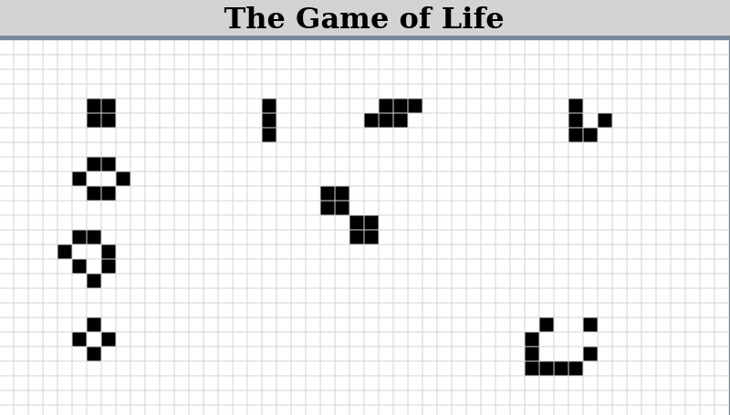
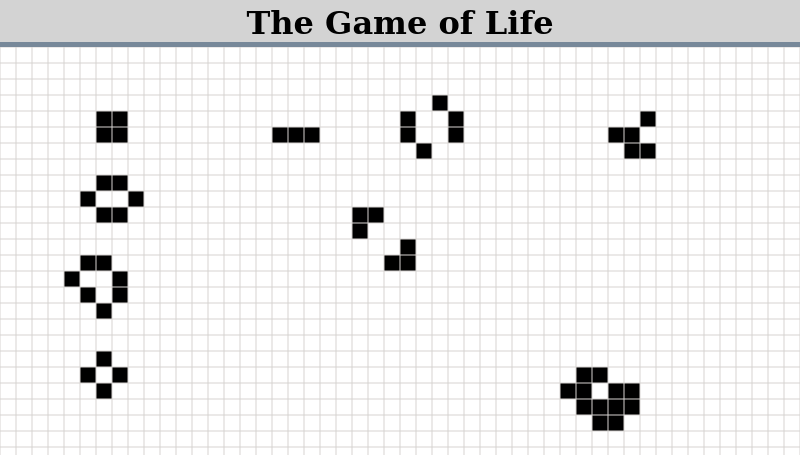
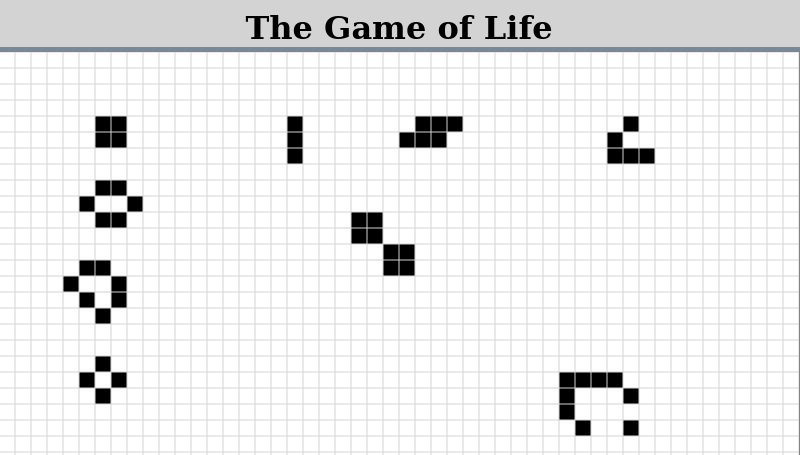

### The Game of Life!

View the project live [here](https://brenton-j-andrews.github.io/Game_of_Life/).

---

### About this project

A recreation of John Conway's [Game of Life](https://en.wikipedia.org/wiki/Conway%27s_Game_of_Life)!

This project was completed to get some more practice with JavaScript basics while creating something kind of interesting. The grid was created using the HTML canvas element, which I was unfamiliar with until this encounter. 

To 'play', click the grid to create your intial structure. Reclicking a filled in cell will un-fill it. Once you are happy with the initial shape, you can click thru single iterations of the game loop or automate the process by pressing the start button.

[Here](http://pi.math.cornell.edu/~lipa/mec/lesson6.html) are some static images of shapes which exhibit known behavior.

The speed adjustment bar is slowest when it is furthest to the right and fastest when farthest to the left. I know this is counter intuitive but I couldn't figure out a way to reverse the values of the HTML element.

--- 

### Frameworks

This project was created with vanilla JavaScript, HTML and CSS. No frameworks used.

--- 

### Takeaways

I had fun with this project. Implementing the rules of The Game of Life wasn't overly difficult but still required some though. The most annoying part was  capturing the click coordinates and filling in the associated cell on the canvas element. The product shown in the demo here isn't quite completed and seems to have some issues working in other browsers (it was built in Firefox), lesson learned for future projects I suppose!

One experiment that I did with this project was keeping a project notebook detailing my progress, pseudocode and thoughts. I found that I could spend 30 minutes writing out the pseudo code for a function I want to implement, and then successfully implement it with 5 minutes of coding. Nice lesson for the future! And I just typed up the pseudocode after writing it on paper FYI.

For projects like this where there are very clear requirements I kind of enjoyed keeping the notebook. For more common web dev projects that I've done since, I can't imagine it would be as useful. It is the 'Game_Of_Life_Notes' document contained in this repo.

---

### To Do

This project isn't quite completed, here are some things to do for completion:
- Add ability for objects to transport from the bottom to top of the screen. 
- Finish project styling and the 'explaination' page link.
- Check for browser compatiblity.
- Reverse the values for the speed adjustment bar.
